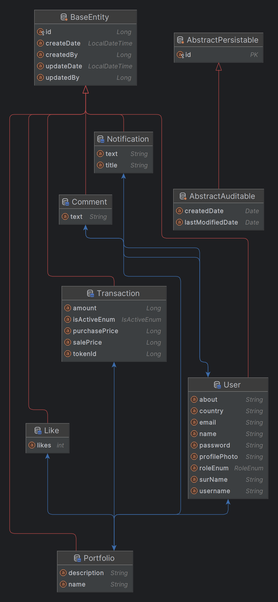

# CryptoTrackingApp

A social media application where users can follow each other's portfolios and comment and like.


## Run on Your Computer

Clone This project

```bash
  git clone https://link-to-project
```

Go to the project directory
```bash
  cd my-project
```


Docker  build

```bash
docker-compose build
```

Docker  run

```bash
docker-compose up
```


## Kullanılan Teknolojiler

**Backend:** Java , Springboot\
**Tools:** Jpa,Hibernate,Mapstruct,Jwt,lombok \
**DataBase:** PostgreSql  \
**Deploy:** Jenkins, Git,Docker,Aws


## API Kullanımı
### Note: 
Not all APIs have been written, they will be completed when the project is completed.
#### Get All User

```http
  GET /http://localhost:8080/v1/user/getAll
```

| Parameters | Type     | Comment |
|:-----------|:---------|:--------|
| `No key`   | `string` | No Auth |

#### Create User

```http
  Post /http://localhost:8080/v1/user/create
```
| Parameters | Type     | Comment |
|:-----------|:---------|:--------|
| `No key`   | `string` | No Auth |


#### Request Body
{\
"roleEnum": "USER",\
"name": "name_15jg0",\
"surName": "surName_gbezq",\
"email": "eray123",\
"password": "123",\
"profilePhoto": "profilePhoto_q96ko",\
"about": "about_4ia4a",\
"country": "country_kvkxo",\
"username": "Aeray"\
}


## Entity Relationship Diagram



## Usage/Examples
### Those who want to write an API should use the Rest Response class as the return value

```Java
 @GetMapping("/getAll")
    public ResponseEntity<RestResponse<List<UserDtoRes>>> getAllUser() {
        
        return new ResponseEntity<>(RestResponse.of(userService.getAllUsers()), HttpStatus.OK);

    }
   
```
### Those who want to write custom error classes extend the Business exception class
```Java

@ResponseStatus(HttpStatus.NOT_FOUND)
public class NotfoundException extends BusinessException{
    public NotfoundException(BaseErrorMessage baseErrorMessage) {
        super(baseErrorMessage);
    }
}
   
```


### Those who want to write a service should first write the interface and fill it with applications.

### All repositories must extend Jparepository
   

  